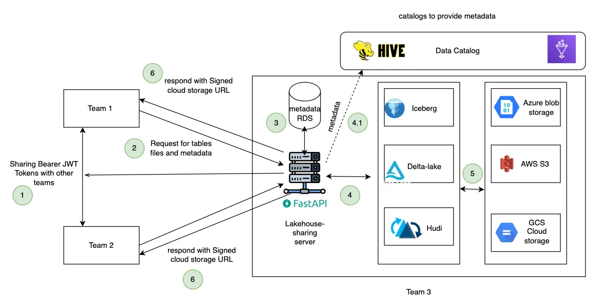

# LakeHouse Sharing

Lakehouse is getting more and more popular nowadays, and many Oragnization seeing massive value in building and maintaining the lakehouse instead of maintaining the Warehouse technologies for various reasons. There are lot of great articles covering this topic in the internet or ask ChatGPT to know more about this area.

This repo in particular belongs to one such part of lakehouse ecosystem, where the concern is how to share data securely, within the org and outside of the organization. Heavily inspired, infact the complete idea is from Delta-sharing protocol. delta-sharing solves the data-sharing problem for the people using Delta Table format and Databricks (company behind Delta-lake) provides excellent self-service tools on top of open source delta-sharig


### Motivation of this Repo:
- Delta-sharing Framework is a protocol which can be adopted to other Table formats (Hudi and iceberg) apart from Delta
    - A Quick POC (Super alpha stage) to prove that protocol can be implemented easily and adopted to other table formats as well
- Original Delta-sharing server was written in Scala, This repo inspired that server implementation and written in Python language which can be good starting point for python developers, and can be adopted by the organizations where python deployment stack (infra stack) is already available.
- This Repo provides Alpha implementation of Sharing protocol for Iceberg table format using Pyiceberg. This can be enhanced/improved based on the interest.
- This Repo rewrites the sharing protocol for Delta table format as well using delta-rs (actually this is super to implement this protocol on top of this python package)

### Difference between normal querying and querying via delta-sharing
- Lot of Engines like Spark,Trino,Presto,Dremio queries Table format efficiently why we need delta-sharing.
- In Delta sharing, you can logically group required few tables and send them as shares to the other teams or other org.
- you need to share the token to the user, they can use that token to authenticate with delta-sharing server, once authenticated
  they can read the data from lakehouse without worrying about s3 authentication IAM cross account configurations etc..

### Installation

Run this commands in the root folder of this project

#### help:

```sh

Usage:
  make <target>

Targets:
  venv                           create a virtual environment for development
  start_backend_server           starts prefect server
  start_frontend_server          starts prefect agent
  help                           Show help
```
#### install requirements

```sh
make venv
```
To share iceberg table format install following extra package
and setup catalog like AWS Glue or Hive, refer [PyIceberg documentation](https://py.iceberg.apache.org/configuration/)

#### for iceberg

```sh
# install iceberg
pip install pyiceberg
```

To share delta-lake table format, install delta-lake package and delta-lake doesn't need any catalog it will directly fetch the metadata from table formats metadata in cloud storage files.

#### for delta-lake

```sh
pip install deltalake

```

### start backend server

```sh
make start_backend_server
```

### start Frontend server
In another termianl start frontend streamlit APP.

```sh
make start_frontend_server
```

### Use docker setup

use docker setup to quickly setup the app

```sh
docker-compose up
```

Set few of the Environment variables before starting the docker-compose up
refer  `.env.example` file for setting the variables

### APP urls:

Once docker-compose was up and running successfully, we can expect following urls

- RDS Admin : http://localhost:8081/
- Postgres : host: localhost, port:5433
- Backend (FastAPI): http://localhost:8001/docs
- Frontend (streamlit): http://localhost:8501

- Set the following env variables accordingly and Run `sqls/prepopulate_data.py` for creating superuser and few test tables

  - for local setup set `export env=local`
  - for docker setup set `export env=docker`

#### Frontend:
  - Login Username : `admin`
  - Login password : `admin@123`

### Lakehouse- sharing Architecture


### Code structure

- For more details about the backend and frondend refer respective directories

```
.
├── Makefile
├── README.md
├── backend
│   ├── Dockerfile
│   ├── app
│   │   ├── README.md
│   │   ├── __init__.py
│   │   ├── __pycache__
│   │   ├── conf.py
│   │   ├── core
│   │   │   ├── __init__.py
│   │   │   ├── __pycache__
│   │   │   ├── base.py
│   │   │   ├── cloud
│   │   │   │   ├── __init__.py
│   │   │   │   ├── __pycache__
│   │   │   │   ├── aws.py
│   │   │   │   ├── azure.py
│   │   │   │   ├── base.py
│   │   │   │   └── gcs.py
│   │   │   ├── delta
│   │   │   │   ├── __init__.py
│   │   │   │   ├── __pycache__
│   │   │   │   ├── models.py
│   │   │   │   ├── share.py
│   │   │   │   └── utils.py
│   │   │   └── iceberg
│   │   │       ├── __init__.py
│   │   │       ├── __pycache__
│   │   │       ├── models.py
│   │   │       └── share.py
│   │   ├── db
│   │   │   ├── __init__.py
│   │   │   ├── __pycache__
│   │   │   ├── auth_queries.py
│   │   │   ├── queries.py
│   │   │   └── tables.py
│   │   ├── main.py
│   │   ├── models
│   │   │   ├── __init__.py
│   │   │   ├── __pycache__
│   │   │   ├── admin.py
│   │   │   ├── auth.py
│   │   │   ├── common.py
│   │   │   └── response.py
│   │   ├── routers
│   │   │   ├── __init__.py
│   │   │   ├── __pycache__
│   │   │   ├── admin.py
│   │   │   ├── auth.py
│   │   │   └── share.py
│   │   ├── securities
│   │   │   ├── __init__.py
│   │   │   ├── __pycache__
│   │   │   ├── jwt_utils.py
│   │   │   └── user_auth.py
│   │   ├── serverconf.yaml
│   │   └── utilities
│   │       ├── __init__.py
│   │       ├── __pycache__
│   │       ├── defaults.py
│   │       ├── exceptions.py
│   │       ├── pagination.py
│   │       ├── responses.py
│   │       └── validators.py
│   ├── requirements.txt
│   └── tests
│       ├── __init__.py
│       ├── __pycache__
│       ├── mock_results.py
│       └── test_share_apis.py
├── docker-compose.yaml
├── frontend
│   ├── Dockerfile
│   ├── README.md
│   ├── app
│   │   ├── __init__.py
│   │   ├── __pycache__
│   │   ├── core
│   │   │   ├── __init__.py
│   │   │   ├── __pycache__
│   │   │   ├── api
│   │   │   │   ├── __init__.py
│   │   │   │   ├── __pycache__
│   │   │   │   ├── config.py
│   │   │   │   ├── jwt_auth.py
│   │   │   │   └── rest.py
│   │   │   ├── base
│   │   │   │   ├── __init__.py
│   │   │   │   ├── __pycache__
│   │   │   │   ├── auth.py
│   │   │   │   ├── client.py
│   │   │   │   └── layout.py
│   │   │   ├── link.py
│   │   │   ├── login.py
│   │   │   ├── schema.py
│   │   │   ├── share.py
│   │   │   ├── table.py
│   │   │   ├── table_format.py
│   │   │   └── user.py
│   │   └── main.py
│   ├── config.yaml
│   └── requirements.txt
├── images
│   └── lakehouse-sharing-arch.png
├── notebooks
│   ├── client-example.ipynb
│   └── profile.json
└── sqls
    └── prepopulate_data.py
```

### Roadmap:
- Improve Backend database Modeling
- improve test cases and performance
- Try adopting this protocol for Hudi table format
- Try to capture change data feed (CDF) from delta and iceberg
- PAckage this code in docker and wrap it up in Helm chart
- For iceberg currently we are using glue catalog,
    load metadata directly from cloud storage without catalog
